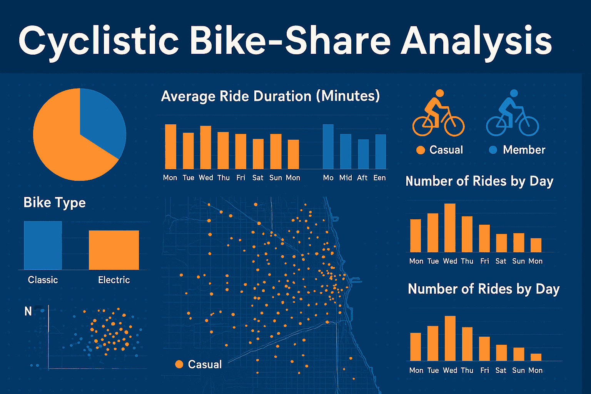
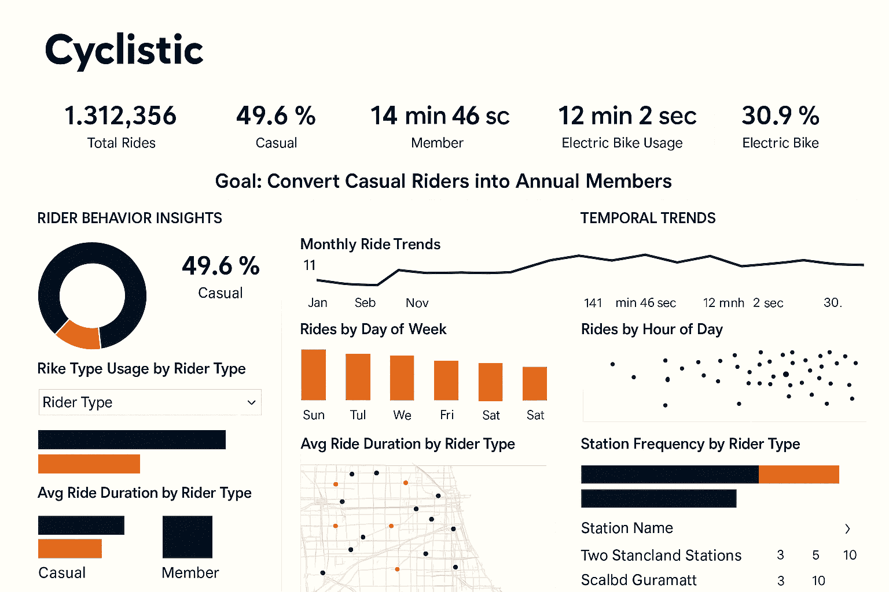

# 🚴 Cyclistic Bike-Share Analysis — Google Data Analytics Capstone

## 📘 Project Description

This capstone project is the culmination of the **Google Data Analytics Professional Certificate**, completed by Francis Olum. It explores how casual riders and annual members use Cyclistic’s bike-share service differently, with the goal of converting casual riders into loyal annual members.

Using **Power BI**, **Power Query**, and structured business analytics methodology (ASK → ACT), this project delivers a stakeholder-ready dashboard, actionable insights, and strategic recommendations.

---

## 🎯 Business Task

> **How do annual members and casual riders use Cyclistic bikes differently?**

Cyclistic’s marketing team wants to understand rider behavior to design campaigns that convert casual riders into annual members—who contribute higher profit margins and long-term value.

---

## 🛠️ Tools & Technologies

- **Power BI Desktop** (dashboard design & storytelling)
- **Microsoft Excel with Power Query** (data cleaning & transformation)
- **Markdown** (modular documentation)
- **PDF Report** (visual summary)
- **Coursera Google Data Analytics Certificate**  
  [Verify Credential](https://coursera.org/verify/professional-cert/SLZ7ERDFU7TL)

---

## 📁 Repository Structure

Cyclistic-Capstone/
├── ASK.md
├── PREPARE.md
├── PROCESS.md
├── ANALYZE.md
├── SHARE.md
├── ACT.md
├── Cyclistic_Report_Visuals.pdf
├── README.md

---

## 📊 Key Findings

- Casual riders take longer rides (~20–25 mins), mostly on weekends and afternoons.
- Members ride more frequently (~8–12 mins), especially during weekday commute hours.
- Electric bikes are more popular among members; casual riders prefer classic bikes.
- Casual riders favor stations near parks and tourist areas; members use transit-linked stations.
- Targeted promotions and commute incentives can drive membership conversions.

---

## 📈 Dashboard Preview

> 

---

## 🧠 What I Learned

- How to apply the full data analysis lifecycle: Ask → Prepare → Process → Analyze → Share → Act
- Data cleaning and transformation using Power Query
- Building interactive dashboards in Power BI
- Communicating insights through visual storytelling
- Translating data into strategic business actions

---

## 📬 Author

**Francis Olum**  
Creative full-stack developer | Business analytics practitioner  
📍 Nairobi, Kenya  
🔗 📧 [Email](olumfrank48@gmail.com)

---

## 📜 License

This project is licensed for educational and portfolio use.  
All data used is publicly available and anonymized.  
No proprietary or confidential information is included.

---
